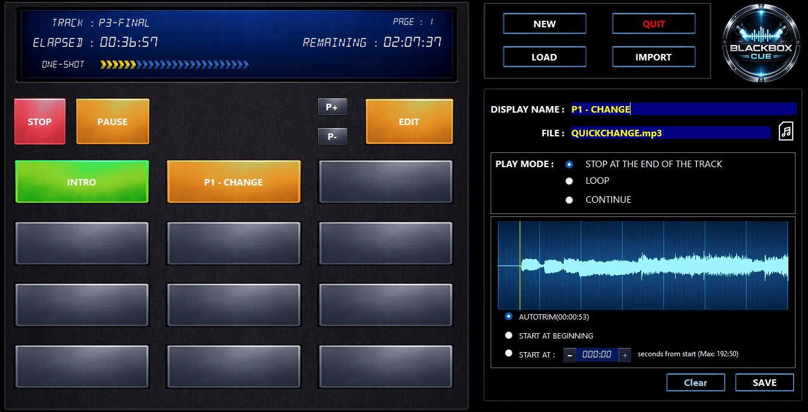
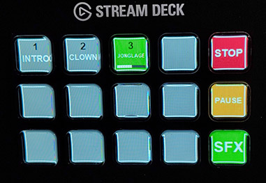

# BlackBox Cue

A free audio cue player for theater, live shows, and stage events. Also ideal for any place that needs background music: waiting rooms, shops, restaurants, exhibitions, and more. Precision without complexity.

---

## Why BlackBox Cue?

BlackBox Cue is designed for **live, reactive use**. Unlike traditional cue list software that requires extensive pre-programming, BlackBox Cue works like a **sound palette**: all your audio files are laid out on pads, ready to be triggered instantly with a single click.

No complex setup, no programming, no learning curve. Import your files, and you're ready to go.

### Who is it for?

- **Live stage managers** -- Adjust music directly during rehearsal. No prep time needed: assign a file, set the behavior, play.
- **Improvisation shows** -- Nothing is scripted. The sound operator reacts in real time with 108 sounds at their fingertips.
- **Solo performers** -- One-man shows, magicians, storytellers: control your own soundtrack hands-free with a wireless presenter or a Stream Deck, without a sound engineer.
- **Dance schools and choreographers** -- Start, stop, and switch music instantly with crossfade transitions. Auto-Trim skips the silence so your cues start right on the beat.
- **Theater companies and workshops** -- Build an efficient cue list in minutes, not hours. Each pad has its own end behavior (one-shot, loop, continue), start behavior (auto-trim, custom offset), and fade settings.
- **Young audience shows** -- Timing depends on the audience's reactions. Trigger any sound at any moment, in any order.
- **Background music** -- Waiting rooms, shops, restaurants, exhibitions: set up a playlist with Continue mode and crossfade, and let it run.

### Precision without complexity

BlackBox Cue gives you the tools that matter for live playback, without the overhead of a full show-control system:

- **Auto-Trim** automatically detects and skips silence at the beginning and end of each track, so your cues start and end exactly on the sound.
- **Remaining time** is always visible during playback, so you know exactly how much time is left before the next cue.
- **Per-track fade-in and fade-out** with adjustable duration (0 to 10 seconds) for smooth transitions.
- **Per-track end behavior**: one-shot, loop, or continue to the next pad -- configured once, reliable every time.
- **Equal-power crossfade** between tracks for seamless transitions.
- **Volume normalization** automatically balances all your tracks to a consistent perceived volume, even when audio files come from different sources.
- **Waveform display** in Edit Mode lets you see exactly where your audio starts, ends, and where the trim points are.

---

## Getting Started

### Installation

**Windows:**

1. Download the latest release from GitHub
2. Run the installer
3. Launch BlackBox Cue

**macOS (Apple Silicon):**

1. Download the `.dmg` file from GitHub
2. Open the `.dmg` and drag BlackBox Cue to your Applications folder
3. Launch BlackBox Cue

### Requirements

- Windows 10 or 11 (64-bit), or macOS 11+ on a Mac with Apple Silicon
- An audio output device

---

## Your First Project

### Create a New Project

1. Click the **New** button
2. Choose a folder where your project will be saved
3. A `.bbc` project file and an `imports` folder are created automatically

The `imports` folder is where all your audio files will be stored.

**Important:** Do not place two `.bbc` files in the same folder. Since the `imports` folder is created alongside the `.bbc` file, two projects in the same folder would share the same audio files, which can lead to confusion.

**Note:** You must create a new project or open an existing one before you can start working with pads.

### Open an Existing Project

Click the **Open Project** button and select a `.bbc` file.

### Backup and Transfer

To back up or transfer a project to another computer, simply copy the `.bbc` file and the `imports` folder located in the same directory. To restore or import a project, copy both files back — the `imports` folder must be in the same directory as the `.bbc` file.

---

## Importing Audio Files

BlackBox Cue supports **WAV**, **MP3** and **AIFF** audio files.

AIFF files are automatically converted to WAV format during import.

### Import a Single File

1. Click the **Import** button
2. Select an audio file from your computer
3. Give it a name (or keep the original)
4. For WAV and MP3 files, the file is copied into your project's `imports` folder. The copy is secured: the integrity of the destination file is verified against the source file to ensure no data was lost or corrupted
5. For AIFF files, the file is converted to WAV format and saved into your project's `imports` folder. 

### Auto-Assign (Bulk Import)

To quickly fill all pads at once:

1. Click on "Switch to crossfade mode"
2. Click the **Auto-Assign** button
3. Select a folder containing your audio files (subfolders are included)
4. Confirm the operation (this will erase all existing pads)
5. Files are automatically copied, assigned to pads, and named

If the folder contains more than 108 files, 108 files are randomly selected for assignment. This means each Auto-Assign produces a different playlist, which is great for keeping background music fresh.

This is useful for quickly setting up a show with many sound cues.

---

## Pads

BlackBox Cue gives you **108 pads** organized across **9 pages** of 12 pads each.

Each pad can hold one audio file and has its own playback settings.

### Playing a Pad

Simply click a pad to play it. The pad lights up green while playing.

### Navigating Pages

- Use the **Page Up** and **Page Down** buttons to switch between pages
- The current page number is shown at the top of the screen

---

## Edit Mode

To configure a pad, switch to **Edit Mode** by clicking the **Edit** button.

In Edit Mode, clicking a pad selects it for editing (it lights up yellow). You can then:

- **Assign an audio file** using the Browse button
- **Set a caption** (the name shown on the pad, up to 14 characters)
- **Choose an end behavior** (what happens when the track finishes)
- **Choose a start behavior** (where playback begins)
- **Save** 

### End Behavior

- **One-Shot** : the track plays once and stops
- **Loop** : the track repeats indefinitely (ideal for ambient sounds or music loops)
- **Continue** : when the track ends, the next pad plays automatically (ideal for sequential cue lists). In crossfade mode, when the last pad (108) finishes, playback loops back to pad 1

### Start Behavior

- **Start from zero** : playback begins at the very start of the file
- **Auto-Trim** : playback skips any silence at the beginning and at the end of the file (detected automatically). Note: Auto-Trim only works if the silence does not exceed 10 seconds. Beyond 10 seconds, the silence is considered intentional and part of the track, so it will be played normally
- **Custom offset** : playback starts at a time you choose, adjustable with the +/- buttons

### Waveform Display

In Edit Mode, a waveform of the audio file is displayed. Click the waveform to toggle between viewing the **beginning** and the **end** of the track.

An yellow line indicates the Auto-Trim start point. An orange line indicates the Auto-Trim end point. A cyan line shows your custom start offset.

---

## Playback Controls

### Stop

Click the **Stop** button to stop all playback, including any SFX currently playing.

- If a fade-out is configured, the first press starts the fade-out
- Press again during the fade to stop immediately

### Pause / Resume

Click the **Pause** button to pause playback. Click it again to resume. The time display blinks while paused.

### Seek

Click on the progress bar to jump to any position in the track.

---

## Fade Controls

### Fade-In

Set the duration of a smooth volume ramp-up when a track starts playing. Adjustable from 0 to 10 seconds.

- Click **+** or **-** to adjust by 0.2 seconds
- Hold **Shift** and click to adjust by 1 second
- Hold the button to auto-repeat

### Fade-Out

Set the duration of a smooth volume ramp-down when you press Stop. Adjustable from 0 to 10 seconds. Same controls as Fade-In.

### Crossfade

Enable the **Crossfade** checkbox to smoothly transition between tracks. When you play a new pad while another is playing, the old track fades out while the new one fades in simultaneously. The crossfade duration is adjustable from 1 to 10 seconds.

---

## SFX Pads

In addition to the 108 main pads, BlackBox Cue provides **2 dedicated SFX pads** (SFX 1 and SFX 2) for sound effects.

SFX pads play **independently** from the main playback: you can trigger one or both SFX while a main pad is playing, without interrupting it. Both SFX pads can also play simultaneously.

SFX pads are always **one-shot** (no loop, no continue). They have their own **volume slider** (0–130%), independent from the main fader. This allows you to set a fixed level for your sound effects regardless of the main output volume. Values above 100% allow you to boost quieter sound effects.

To configure an SFX pad, switch to Edit Mode and click the SFX 1 or SFX 2 button. You can assign an audio file, choose a start behavior, and adjust the volume level.

---

## Volume

Use the vertical **volume fader** on the right side of the screen to adjust the output volume. Drag it up to increase volume, down to decrease.

### Volume Normalization

Enable the **Normalize** checkbox to automatically balance the volume across all your tracks. Audio files are often recorded at different levels, which can cause jarring volume jumps when switching between pads.

When normalization is enabled, BlackBox Cue analyzes the level of each audio file and adjusts the playback gain so that all tracks are perceived at a consistent volume.

---

## VU Meter

The LED-style VU meter shows the real-time audio output level, with a peak indicator.

---

## Display

During playback, the screen shows:

- **Track name** : the filename of the current audio
- **Elapsed time** : how long the track has been playing
- **Remaining time** : how much time is left
- **Playback mode** : LOOP, ONE-SHOT, or CONTINUE

---

## Wireless Presenter Support

BlackBox Cue is compatible with wireless presenters (the kind used for PowerPoint presentations).

Enable the **Remote** checkbox, then use your presenter to control playback hands-free:

| Button | Action |
|--------|--------|
| Volume Down | Play the selected pad |
| Volume Up (short press) | Stop playback |
| Volume Up (long press >2s) | Advance to the next pad |
| Page Down | Select next pad |
| Page Up | Select previous pad |
| B key | Stop playback and advance to the next pad |

The selected pad is highlighted on screen. Navigation automatically switches pages when needed (in both directions).

---

## Keyboard Shortcuts

BlackBox Cue supports keyboard shortcuts for quick playback control (active outside of Edit Mode):

| Key | Action |
|-----|--------|
| F1 – F12 | Play pad 1–12 of the current page |
| 1 | Play SFX 1 |
| 2 | Play SFX 2 |
| Space | Stop playback |
| Page Up | Previous page |
| Page Down | Next page |

These shortcuts are disabled when typing in a text field or when a dialog is open.

---

## Stream Deck Support

BlackBox Cue supports the **Elgato Stream Deck** (15-key model) as a physical control surface.

### Automatic Detection

When a project is open, BlackBox Cue periodically checks for a connected Stream Deck. When detected, the **Enable Stream Deck** checkbox and label appear. If the Stream Deck is disconnected, it reverts to "STREAM DECK NOT DETECTED" automatically.

**Important:** The Elgato Stream Deck software must be closed before enabling the Stream Deck in BlackBox Cue to avoid unwanted interactions between the two applications.

### Key Layout

The 15 keys are organized as follows:

| | Col 1 | Col 2 | Col 3 | Col 4 | Col 5 |
|---|---|---|---|---|---|
| Row 1 | Pad 1 | Pad 2 | Pad 3 | Pad 4 | **STOP** |
| Row 2 | Pad 5 | Pad 6 | Pad 7 | Pad 8 | **PAUSE** |
| Row 3 | Pad 9 | Pad 10 | Pad 11 | Pad 12 | **PAGE** |

- Pad keys display the **pad number** (in black, at the top) and the **caption** (in white, below)
- The currently playing pad is shown in **green** with a **progress bar**
- Empty pads are shown in grey

### SFX and Page Modes

The bottom-right key cycles through three modes: **Normal → SFX → Page → Normal**.

| Key | Normal | SFX Mode | Page Mode |
|-----|--------|----------|-----------|
| Key 5 (top right) | STOP | SFX 1 | P+ (next page) |
| Key 10 (middle right) | PAUSE | SFX 2 | P- (previous page) |
| Key 15 (bottom right) | SFX | PAGE | RETURN |

---

## Tips

- **Sleep prevention** : BlackBox Cue automatically prevents your computer from going to sleep or turning off the screen while the application is running, so your show won't be interrupted.
- **Continue mode** : Use Continue mode across all your pads to create an automatic playlist that plays through your entire cue list.
- **Crossfade + Continue** : Combine crossfade with Continue mode for seamless transitions between tracks.
- **Auto-Trim** : Most audio files have a small amount of silence at the beginning. Auto-Trim detects this and skips it, so your cues start right on the sound. Silence longer than 10 seconds at the beginning or end of a track is considered intentional and will not be trimmed.

---

## Quick Start: Background Music Playlist

Setting up a background music playlist for a waiting room, restaurant, or exhibition takes less than a minute:

1. Create a new project
2. Switch to crossfade mode
3. Click the **Auto-Assign** button and select a folder containing your music files. If the folder contains more than 108 files, 108 files are randomly selected. Playback will loop back to pad 1 once the last pad has finished playing
4. Click the **Norm** button below the volume fader to enable volume normalization
5. Adjust the output volume to the desired level
6. Set the crossfade to about 5 seconds for smooth transitions
7. Click the first pad to start playback

That's it -- your playlist runs on its own with seamless transitions between tracks.

**Tip:** If you import a jingle (using the Import function) while in Continue mode, you can then assign that same jingle to several pads on different pages. This lets you insert a jingle at various points throughout the playlist. The same trick works for advertising spots.

---

## License

Copyright (c) 2025 Cyril LAMY. All rights reserved.

This software is **FREEWARE**. You may use and distribute it freely for personal or commercial purposes.

**DISCLAIMER:** This software is provided "as is", without warranty of any kind. The author shall not be liable for any claim, damages, or other liability arising from the use of this software.

---

