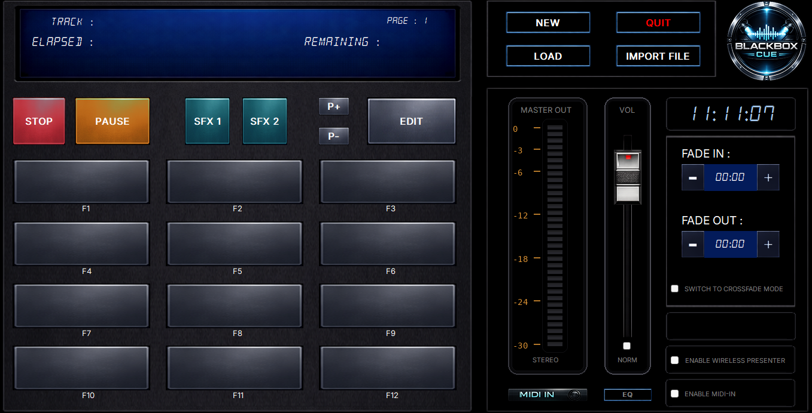
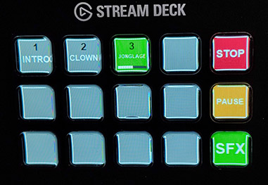

# BlackBox Cue

A free audio cue player for theater, live shows, and stage events. Also ideal for any place that needs background music: waiting rooms, shops, restaurants, exhibitions, and more. Precision without complexity.

---

## Why BlackBox Cue?

Not every booth needs a locked-down timeline. Most need to react fast, play the right sound at the right moment, chain cues cleanly, and stay in control when things go live. Theater, dance, improv, young audiences, solo shows, events, background music: in the real world, cueing is more often live than scripted. BlackBox Cue was built for that reality.

BlackBox Cue works like a **sound palette**: all your audio files are laid out on pads, ready to be triggered instantly with a single click. No complex setup, no programming, no learning curve. Import your files, and you're ready to go.

### Who is it for?

- **Live stage managers** -- Adjust music directly during rehearsal. No prep time needed: assign a file, set the behavior, play.
- **Improvisation shows** -- Nothing is scripted. The sound operator reacts in real time with 300 sounds at their fingertips.
- **Solo performers** -- One-man shows, magicians, storytellers: control your own soundtrack hands-free with a wireless presenter or a Stream Deck, without a sound engineer.
- **Dance schools and choreographers** -- Start, stop, and switch music instantly with crossfade transitions. Auto-Trim skips the silence so your cues start right on the beat. Speed control lets you slow down music for choreography practice, then play at normal speed for the show.
- **Theater companies and workshops** -- Build an efficient cue list in minutes, not hours. Each pad has its own end behavior (one-shot, loop, continue), start behavior (auto-trim, custom offset), and fade settings.
- **Young audience shows** -- Timing depends on the audience's reactions. Trigger any sound at any moment, in any order.
- **Background music** -- Waiting rooms, shops, restaurants, exhibitions: set up a playlist with Continue mode and crossfade, and let it run.

### Precision without complexity

BlackBox Cue gives you the tools that matter for live playback, without the overhead of a full show-control system:

- **Auto-Trim** automatically detects and skips silence at the beginning and end of each track, so your cues start and end exactly on the sound.
- **Remaining time** is always visible during playback, so you know exactly how much time is left before the next cue.
- **Per-track fade-in and fade-out** with adjustable duration (0 to 10 seconds) for smooth transitions.
- **Per-track end behavior**: one-shot, loop, or continue to the next pad -- configured once, reliable every time.
- **Equal-power crossfade** between tracks for seamless transitions. In AUTO mode, the crossfade analyzes your music and automatically finds the best moment to transition, adapting to the tempo, key, and structure of each track.
- **Audio output selection** lets you choose which audio device to use, directly from the main interface.
- **Listen preview** in Edit Mode lets you hear the first seconds of a track on a separate audio output before going live. Requires a computer with at least two independent audio outputs.
- **4-band parametric equalizer per pad**, with Low, Low Mid, High Mid, and High bands. Each band offers multiple filter modes (PEQ, VEQ, Low Cut, High Cut, Low Shelf, High Shelf) with adjustable frequency, gain, and Q. A real-time frequency response graph and spectrogram let you visualize the effect of your settings while previewing.
- **Master equalizer** with the same 4-band parametric EQ, applied to the entire audio output. Ideal for adapting to the venue acoustics. Includes a real-time spectrogram of the main output.
- **Audio effects per pad**: apply a reverb, delay, flanger, lo-fi, robot, distortion, or vocal remover effect to any pad. Each effect type comes with ready-to-use presets and a simple wet/dry control. Effects are preserved during crossfade transitions.
- **Speed control per pad**: adjust playback speed from 50% to 120% without changing the pitch. Ideal for dance schools that need to slow down music for learning choreography, then play at full speed for the performance.
- **Volume normalization** automatically balances all your tracks to a consistent perceived volume, even when audio files come from different sources.
- **Waveform display** in Edit Mode lets you see exactly where your audio starts, ends, and where the trim points are.

---

## Getting Started

### Download

Due to the size of the installers, BlackBox Cue is no longer available for download directly from GitHub. Please download the latest version from the official website:

**https://www.blackboxcue.net/**

### Installation

**Windows:**

1. Download the latest release (zip) from the official website and extract it
2. Run the installer
3. Launch BlackBox Cue

**macOS (Apple Silicon):**

1. Download the `.dmg` file from the official website
2. Open the `.dmg` and drag BlackBox Cue to your Applications folder
3. Launch BlackBox Cue

### Requirements

- Windows 10 or 11 (64-bit), or macOS 11+ on a Mac with Apple Silicon
- An audio output device

---

## Your First Project

### Create a New Project

1. Click the **New** button
2. Choose a folder where your project will be saved
3. A `.bbc` project file and an `imports` folder are created automatically

The `imports` folder is where all your audio files will be stored.

**Important:** Do not place two `.bbc` files in the same folder. Since the `imports` folder is created alongside the `.bbc` file, two projects in the same folder would share the same audio files, which can lead to confusion.

**Note:** You must create a new project or open an existing one before you can start working with pads.

### Open an Existing Project

Click the **Open Project** button and select a `.bbc` file.

### Backup and Transfer

To back up or transfer a project to another computer, simply copy the `.bbc` file and the `imports` folder located in the same directory. To restore or import a project, copy both files back — the `imports` folder must be in the same directory as the `.bbc` file.

---

## Importing Audio Files

BlackBox Cue supports a wide range of audio formats: **WAV**, **MP3**, **OGG**, **FLAC**, **AAC/M4A**, **MP4**, **AIFF**, **ALAC**, **WMA**, **Opus**, **CAF**, **AC-3**, **WavPack**, **MKA** (Matroska Audio), **AU**, and **SND**.

### Import a Single File

1. Click the **Import** button
2. Select an audio file from your computer
3. Give it a name (or keep the original)
4. The file is copied into your project's `imports` folder. The copy is secured: the integrity of the destination file is verified against the source file to ensure no data was lost or corrupted

### Import a Folder

Right-click the **Import** button to switch it to **IMPORT DIR** mode. In this mode, clicking the button lets you select a folder instead of a single file. All audio files from the selected folder (including subfolders) are imported at once.

You will be asked to enter a **prefix**. Each imported file will be named `PREFIX-originalfilename` in your project. This helps you organize and identify files by source or category.

Right-click the Import button again to switch back to single file mode (**IMPORT FILE**).

### Auto-Assign (Bulk Import)

To quickly fill pads:

1. Click on "Switch to crossfade mode"
2. Click the **Auto-Assign** button
3. Choose one of the two import modes:
   - **New Import** : erases all existing pads and starts fresh
   - **Fill empty pads** : keeps your existing pads and only fills the empty ones (files already assigned to a pad are not imported again)
4. Select a folder containing your audio files (subfolders are included)
5. Files are automatically copied, assigned to pads, and named

If the folder contains more files than available pads, files are randomly selected for assignment. This means each Auto-Assign produces a different playlist, which is great for keeping background music fresh.

This is useful for quickly setting up a show with many sound cues, or for adding more tracks to an existing project without losing your current setup.

---

## Pads

BlackBox Cue gives you **300 pads** organized across **25 pages** of 12 pads each.

Each pad can hold one audio file and has its own playback settings. Alternatively, a pad can be set to **Blank mode** to play silence for a configurable duration -- useful for timed pauses between tracks or for triggering control cues without any audio.

### Playing a Pad

Simply click a pad to play it. The pad lights up green while playing.

### Navigating Pages

- Use the **Page Up** and **Page Down** buttons to switch between pages
- The current page number is shown at the top of the screen

---

## Edit Mode

To configure a pad, switch to **Edit Mode** by clicking the **Edit** button. The Edit button blinks while edit mode is active as a visual reminder.

In Edit Mode, clicking a pad selects it for editing (it lights up yellow). You can then:

- **Assign an audio file** using the Browse button
- **Set a caption** (the name shown on the pad, up to 14 characters)
- **Choose an end behavior** (what happens when the track finishes)
- **Choose a start behavior** (where playback begins)
- **Listen to a preview** of the first seconds of the track
- **Configure the equalizer** for the pad (enable/disable, adjust bands)
- **Apply an audio effect** (reverb, delay, flanger, lo-fi, robot, distortion, vocal remover)
- **Adjust the playback speed** (50% to 120%, without changing the pitch)
- **Switch to Blank mode** to use the pad as a timed silence instead of an audio file
- **Save**

### Blank Pads (Silence Mode)

Instead of playing an audio file, a pad can be set to **Blank mode** to play silence for a configurable duration (1 to 200 seconds). This is useful for:

- **Timed pauses between tracks**: insert a silent interval between two cues in a Continue sequence
- **Control-only pads**: use a pad solely to send MIDI, OSC, or AUDIO control cues at precise moments, without any sound playing

To create a Blank pad:

1. In Edit Mode, **double-click the FILE label** (next to the file name field) to toggle between FILE and BLANK mode
2. Use the **-/+** buttons to set the silence duration. Hold the button for faster adjustments (increments of 10 seconds)
3. Add control cues in the CTRL tab if needed
4. Click **Save**

**Blank pad behavior:**

- The pad always plays in **Continue** mode with no loop, no Auto-Trim, and no offset
- The **equalizer**, **audio effects**, **Pre-Wait**, **Post-Wait**, and **Speed** settings are disabled
- During playback, the display shows "BLANK *n* SECONDS" instead of a filename
- **Crossfade is bypassed**: when a Blank pad is playing, it always plays to the end before the next pad starts -- there is no crossfade transition
- **Control cues** work normally during the silence, synchronized to the pad's elapsed time
- The **Clear** button resets the pad back to normal (non-blank) mode

To switch a Blank pad back to FILE mode, double-click the BLANK label again. If a file was previously assigned, the pad data (BPM, Auto-Trim, fade points) is recalculated from the file. If the file no longer exists, the pad is reset (except for the caption).

### End Behavior

- **One-Shot** : the track plays once and stops
- **Loop** : the track repeats indefinitely (ideal for ambient sounds or music loops)
- **Continue** : when the track ends, the next pad plays automatically (ideal for sequential cue lists). In crossfade mode, when the last assigned pad finishes, playback loops back to the first assigned pad. In one-shot mode on the last assigned pad, playback ends with a smooth fade-out

### Start Behavior

- **Start from zero** : playback begins at the very start of the file
- **Auto-Trim** : playback skips any silence at the beginning and at the end of the file (detected automatically). Note: Auto-Trim only works if the silence does not exceed 10 seconds. Beyond 10 seconds, the silence is considered intentional and part of the track, so it will be played normally
- **Custom start and end points** : set a custom start point and end point within the track to play only a specific portion of the file -- for example, just the chorus or a particular passage. Use the +/- buttons to adjust each point. A minimum gap of 1 second is enforced between start and end

### Pre-Wait and Post-Wait

Each pad can have a **pre-wait** (silence before playback) and a **post-wait** (silence after playback), adjustable from 0 to 600 seconds.

- **Pre-Wait**: when you trigger a pad, the software waits for the specified duration before starting the audio. The display shows a countdown during the wait. Useful for inserting a timed pause before a sound effect, or giving performers time to get into position.
- **Post-Wait**: after the track finishes playing, the software waits before moving to the next action (continue to next pad, or stop). The display shows a countdown during the wait. Useful for inserting a silence between two consecutive cues.

Pre-wait and post-wait only apply when crossfade is disabled. In crossfade mode, tracks transition directly into each other, so waits are not used.

Use the **+/-** buttons to adjust each value. Hold the button for faster adjustments.

### Waveform Display

In Edit Mode, a waveform of the audio file is displayed. Click the waveform to toggle between viewing the **beginning** and the **end** of the track.

A yellow line indicates the Auto-Trim start point. An orange line indicates the Auto-Trim end point. A cyan line shows your custom start offset. A red dotted line shows the detected fade-out position (used by AUTO crossfade).

The editor also displays analysis information for the current track: detected BPM (tempo), fade-out position, or energy drop point. This data is used by the AUTO crossfade to find the best transition moment.

### Parametric Equalizer (per-pad)

Each pad can have its own **4-band parametric equalizer**, similar to those found on professional mixing consoles. This equalizer works directly on the audio source, **before** the volume fader and **before** the master EQ. Think of it as preparing and correcting each track individually: removing unwanted rumble, taming harsh frequencies, or adding warmth -- regardless of how loud or quiet the final output will be. Just like a sound engineer would EQ each channel on a mixing desk before adjusting the master output.

Enable the equalizer with the **Enable Equalizer** checkbox, then select a band (LOW, LOW MID, HIGH MID, HIGH) and adjust its settings:

- **Mode**: choose the filter type for each band. The available modes depend on the band:
  - **Low Cut**: removes all frequencies below the cutoff frequency. Useful for cleaning up low-end noise or unwanted bass in a recording
  - **Low Shelf**: boosts or cuts all frequencies below the set frequency. Use it to add warmth or reduce muddiness
  - **High Cut**: removes all frequencies above the cutoff frequency. Useful for taming harsh high frequencies or reducing hiss
  - **High Shelf**: boosts or cuts all frequencies above the set frequency. Use it to add brightness or reduce sibilance
  - **PEQ** (Parametric EQ): boosts or cuts a specific frequency range, with the Q parameter controlling how narrow or wide the affected area is. The most precise mode for surgical corrections
  - **VEQ** (Vintage EQ): similar to PEQ, but with a wider, more musical response. Behaves like classic analog equalizers -- better for broad tonal shaping
  - **Off**: the band is bypassed

  LOW supports Off, Low Cut, Low Shelf, PEQ, and VEQ. HIGH supports Off, High Cut, High Shelf, PEQ, and VEQ. The mid bands support Off, PEQ, and VEQ
- **Frequency**: set the center or cutoff frequency for the band
- **Gain**: boost or cut the selected frequency range (from -15 to +15 dB)
- **Q**: adjust the bandwidth of the filter. A low Q value gives a wide, gentle curve that affects many surrounding frequencies. A high Q value gives a narrow, sharp curve that targets a precise frequency

Use the **+/-** buttons to adjust each parameter. Hold the button for faster adjustments.

A **frequency response graph** shows the combined effect of all four bands in real time. During preview playback, a **live spectrogram** scrolls across the graph, showing the actual frequency content of the audio. This lets you see the effect of your EQ settings and compare with/without equalization by toggling the checkbox.

EQ settings are saved per pad and applied during playback, including during crossfade transitions where each track keeps its own EQ settings.

### Master Equalizer

In addition to the per-pad EQ, BlackBox Cue provides a **master 4-band parametric equalizer** that applies to the entire audio output. Click the **EQ** button in the main interface to open the master EQ panel.

The master EQ works identically to the per-pad EQ (same bands, same filter modes, same controls), but serves a completely different purpose. While the per-pad EQ corrects each audio source individually, the master EQ shapes the **final output** that reaches the speakers. It applies **after** the per-pad EQ and the volume fader in the audio chain, and affects all pads and SFX simultaneously.

Use the master EQ to adapt to your performance environment:
- **Room acoustics**: reduce boomy low frequencies in a reverberant space, or add bass in an outdoor setting
- **Sound system compensation**: correct for speakers that are too bright, too dull, or have a specific frequency signature
- **Volume-dependent adjustments**: at low listening volumes, the human ear perceives less bass and treble (the Fletcher-Munson effect). The master EQ lets you compensate by gently boosting lows and highs when playing at lower levels

A **real-time spectrogram** on the master EQ panel shows the actual frequency content of the main audio output, including all pads and SFX currently playing. When the master EQ is enabled, the EQ curve is displayed over the spectrogram.

Master EQ settings are saved with your project.

### Audio Effects

Each pad can have an **audio effect** applied on top of its EQ. Enable the effect with the **Enable FX** checkbox, then choose a mode and preset:

- **Reverb**: adds a sense of space to the sound. Presets: Room, Hall, Cathedral, Plate
- **Delay**: creates echoes and repetitions. Presets: Slapback, Echo, Long Delay
- **Flanger**: produces a sweeping, jet-like sound. Presets: Subtle, Medium, Deep
- **Lo-Fi**: degrades the audio quality for a vintage or stylized effect. Presets: Radio, Telephone, Vinyl, 8-Bit
- **Robot**: modulates the sound for a robotic voice effect. Presets: Low, Mid, High
- **Distortion**: adds saturation and grit. Presets: Light, Medium, Heavy
- **Vocal Remover**: reduces center-panned content (typically vocals) from a stereo track. Presets: Remove (full removal), Bass Keep (preserves bass frequencies)

Use the **Level** control (0-100%) to adjust how much of the effect is mixed in. Each effect is heard immediately during preview playback, so you can fine-tune your settings before going live.

Effect settings are saved per pad and applied during playback, including during crossfade transitions.

### Speed Control

Each pad has a **Speed** setting that lets you change the playback tempo from **50% to 120%** without altering the pitch. The technology used (time-stretching) preserves the original pitch of every instrument and voice: slowing down a track sounds like the musicians are playing more slowly, not like a vinyl record being slowed down. The music remains natural and musical at any speed -- only the tempo changes.

Speed is part of the FX settings: it only takes effect when the **Enable FX** checkbox is checked. Use the **+/-** buttons to adjust the speed value.

This is particularly useful for **dance schools and choreographers**: slow down a piece to learn or rehearse a choreography at a comfortable pace, then set the speed back to 100% for the performance. The same pad, the same track, two different tempos -- no need to prepare separate audio files.

The speed can be changed in real time during preview playback, so you can hear the result immediately. Speed settings are saved with the pad.

**How speed interacts with other features:**

- **Elapsed and remaining time**: the time display always shows the **source time** (position in the original track), not the real elapsed wall-clock time. A track played at 50% speed will show 02:00 elapsed after 4 minutes of real time, because only 2 minutes of the original track have been played. This means that a specific musical moment always corresponds to the same displayed time, regardless of the playback speed -- which is essential for dance schools and choreographers who use time markers as reference points during rehearsal.
- **Control cues**: the TIME positions of your control cue events always refer to the original track timeline, regardless of speed. A cue set at 01:30 will still trigger at the 1-minute-30 mark of the original track, even if the playback is slower or faster.
- **AUTO crossfade**: in AUTO mode, the crossfade uses the effective BPM (the detected BPM adjusted by the speed factor) to calculate transitions. The BPM shown in the editor always reflects the detected BPM of the original track.

---

## Playback Controls

### Stop

Click the **Stop** button to stop all playback, including any SFX currently playing.

- If a fade-out is configured, the first press starts the fade-out
- Press again during the fade to stop immediately

When you stop a **one-shot** track (outside crossfade mode), the next pad blinks purple to indicate the next cue to play — just like when the track finishes on its own.

### Pause / Resume

Click the **Pause** button to pause playback. Click it again to resume. The time display blinks while paused.

### Seek

Click on the progress bar to jump to any position in the track.

---

## Fade Controls

### Fade-In

Set the duration of a smooth volume ramp-up when a track starts playing. Adjustable from 0 to 10 seconds.

- Click **+** or **-** to adjust by 0.2 seconds
- Hold **Shift** and click to adjust by 1 second
- Hold the button to auto-repeat

### Fade-Out

Set the duration of a smooth volume ramp-down when you press Stop. Adjustable from 0 to 10 seconds. Same controls as Fade-In.

### Crossfade

Enable the **Crossfade** checkbox to smoothly transition between tracks. When you play a new pad while another is playing, the old track fades out while the new one fades in simultaneously. The crossfade duration is adjustable from 1 to 10 seconds.

#### AUTO Crossfade

In Continue mode, you can set the crossfade duration to **AUTO**. BlackBox Cue then analyzes each track during import and automatically determines the best moment and duration for the crossfade.

This means you don't have to set a fixed crossfade duration — the software handles it for you, producing natural-sounding, musically coherent transitions between tracks of different styles and tempos.

---

## SFX Pads

In addition to the 300 main pads, BlackBox Cue provides **2 dedicated SFX pads** (SFX 1 and SFX 2) for sound effects.

SFX pads play **independently** from the main playback: you can trigger one or both SFX while a main pad is playing, without interrupting it. Both SFX pads can also play simultaneously.

SFX pads are always **one-shot** (no loop, no continue). They have their own **volume slider** (0–130%), independent from the main fader. This allows you to set a fixed level for your sound effects regardless of the main output volume. Values above 100% allow you to boost quieter sound effects.

To configure an SFX pad, switch to Edit Mode and click the SFX 1 or SFX 2 button. You can assign an audio file, choose a start behavior, and adjust the volume level.

---

## Volume

Use the vertical **volume fader** on the right side of the screen to adjust the output volume. Drag it up to increase volume, down to decrease. You can also use the **mouse wheel** over the fader for quick adjustments.

### Listen Volume

Double-click on the **VOL** label above the fader to switch to **LSTN** mode. The fader smoothly slides to the listen (preview) volume position. You can then adjust the preview volume independently from the main output. Double-click again to cycle to **CTRL** mode, then back to **VOL**. The three volumes are always independent: changing one never affects the others.

### CTRL Volume

In **CTRL** mode (label shown in blue), the fader controls the volume of **AUDIO control cues** (BEEP and SPEAK). This lets you adjust the level of stage cue reminders and text-to-speech announcements independently from the main playback and the preview. SPEAK cues routed to MAIN also use the CTRL volume, allowing you to balance voiceover level against the music.

### Audio Output Selection

Double-click on the **MASTER OUT** label above the volume fader to open the Audio Output Settings. This dialog lets you configure three independent audio outputs:

- **MAIN OUTPUT**: one or more devices for pad playback and SFX
- **PREVIEW / PRE-LISTEN**: a single device for preview listening in Edit Mode
- **AUDIO CONTROLS**: one or more devices for BEEP and SPEAK cues (stage cue reminders, voiceover). If not configured, BEEP cues will not play and SPEAK cues routed to CTRL will be silent

### Mono / Stereo

Double-click on the **STEREO** label to switch the output to **MONO**. In mono mode, both channels are mixed together, which is useful when the sound system is mono or when speakers are placed far apart and stereo separation would be distracting. Double-click again to switch back to stereo.

### Volume Normalization

Enable the **Normalize** checkbox to automatically balance the volume across all your tracks. Audio files are often recorded at different levels, which can cause jarring volume jumps when switching between pads.

When normalization is enabled, BlackBox Cue analyzes the level of each audio file and adjusts the playback gain so that all tracks are perceived at a consistent volume.

---

## VU Meter

The LED-style VU meter shows the real-time audio output level, with a peak indicator.

---

## Display

During playback, the screen shows:

- **Track name** : the filename of the current audio
- **Elapsed time** : how long the track has been playing
- **Remaining time** : how much time is left
- **Playback mode** : LOOP, ONE-SHOT, or CONTINUE

---

## Wireless Presenter Support

BlackBox Cue is compatible with wireless presenters (the kind used for PowerPoint presentations).

Enable the **Remote** checkbox, then use your presenter to control playback hands-free:

| Button | Action |
|--------|--------|
| Volume Down | Play the selected pad |
| Volume Up (short press) | Stop playback |
| Volume Up (long press >2s) | Advance to the next pad |
| Page Down | Select next pad |
| Page Up | Select previous pad |
| B key | Stop playback and advance to the next pad |

The selected pad is highlighted on screen. Navigation automatically switches pages when needed (in both directions).

---

## Keyboard Shortcuts

BlackBox Cue supports keyboard shortcuts for quick playback control (active outside of Edit Mode):

| Key | Action |
|-----|--------|
| F1 – F12 | Play pad 1–12 of the current page |
| 1 | Play SFX 1 |
| 2 | Play SFX 2 |
| Space | Stop playback |
| Page Up | Previous page |
| Page Down | Next page |

These shortcuts are disabled when typing in a text field or when a dialog is open.

---

## MIDI

BlackBox Cue supports **MIDI Input** (control the software from a MIDI controller) and **Control cues** (send MIDI, OSC, or audio messages to external devices or to yourself during playback).

### Enabling MIDI

1. Check the **MIDI** checkbox in the main interface
2. A dialog appears listing available MIDI devices in two sections:
   - **MIDI Input**: choose a controller to pilot BlackBox Cue (keyboard, pad controller, etc.). Select a **MIDI channel** (Omni to listen on all channels, or a specific channel from 1 to 16)
   - **MIDI Output**: choose a device to send MIDI cue events to (lighting console, DMX interface, etc.)
3. Click **SELECT** to activate MIDI

You can select an input device only, an output device only, or both at the same time. Uncheck the **MIDI** checkbox to deactivate all MIDI.

A small indicator blinks next to the checkbox each time a MIDI message is received or sent.

### Enabling OSC

1. Check the **OSC** checkbox in the main interface
2. A dialog appears to configure the OSC destination:
   - **IP address**: the IP of the device to send OSC messages to
   - **Port**: the UDP port number
3. Click **OK** to activate OSC

### MIDI Input -- Controlling BlackBox Cue

| MIDI Message | Action |
|---|---|
| Note On 60 to 71 | Play pad 1 to 12 on the current page |
| Note On 72 to 96 | Select page 1 to 25 |
| Note On below 60 | Stop all playback |
| Program Change 1 to 25 | Select page 1 to 25 |

Page selection (via note or Program Change) also updates the current page for subsequent pad triggers.

#### Example Setup

With a standard MIDI keyboard:
- Use the **C4 to B4** keys (notes 60-71) to trigger pads 1-12
- Use the **C5 to C7** keys (notes 72-96) to switch pages
- Use any key **below C4** to stop playback
- Send a **Program Change** to jump directly to a page

### Control Cues -- Sending Commands During Playback

Each pad (including SFX pads) can contain a list of **control cue events** that are sent at precise moments during playback. This is designed for controlling lighting consoles, DMX interfaces, stage equipment, or even sending audio reminders to yourself.

#### How it works

Each cue event is defined by:

- **TIME**: the moment during playback (relative to the track start) when the event should be triggered, in HH:MM:SS format
- **CTRL**: the type of control -- **MIDI**, **OSC**, **AUDIO**, **SET**, or **PAD**

The remaining fields depend on the CTRL type:

**MIDI cues** (requires MIDI Output enabled):
- **TYPE**: **NOTE**, **CC** (Control Change), or **PROG** (Program Change)
- **CH**: MIDI channel (1 to 16)
- **DATA**: note number, CC number, or program number (0-127)
- **VAL**: velocity (for NOTE), CC value (for CC), or unused (for PROG)

**OSC cues** (requires OSC enabled):
- **TYPE**: value type -- **STRING**, **INTEGER**, or **FLOAT**
- **DATA**: the OSC address (e.g. `/cue/go`)
- **VAL**: the value to send

**AUDIO cues** (no external device required):
- **TYPE**: **BEEP** (a short chime tone) or **SPEAK** (text-to-speech)
- **CH**: output routing -- **CTRL** (audio controls output, default) or **MAIN** (main output, for SPEAK only). BEEP always goes to CTRL
- **DATA**: language for SPEAK (English, French, German, Spanish, Portuguese -- detected automatically from installed voice models). Unused for BEEP
- **VAL**: the text to speak (for SPEAK, unused for BEEP)

The volume of all AUDIO cues (BEEP and SPEAK) is controlled by the **CTRL fader**, independently from the main playback volume. SPEAK cues routed to MAIN also use the CTRL volume, so you can balance voiceover announcements against the music.

#### Automation cues (Advanced)

> **Note:** SET and PAD cues are an advanced feature for users who want fine-grained automation of their shows. You do not need to know about them to use BlackBox Cue effectively -- most users will never need them. If you're just getting started, feel free to skip this section entirely.

In addition to MIDI, OSC, and AUDIO, BlackBox Cue offers two automation control types that let you change the software's own settings during playback -- turning each pad into a small automation script.

**SET cues** (change a software setting at a specific moment):
- **TYPE** = **MODE**: switch between fade and crossfade mode. **DATA**: **FADE** or **CROSSFADE**
- **TYPE** = **NORM**: enable or disable volume normalization. **DATA**: **ON** or **OFF**
- **TYPE** = **FADEIN**: set the fade-in duration (only applies in fade mode). **VAL**: duration in seconds (0-10)
- **TYPE** = **FADEOUT**: set the fade-out duration (only applies in fade mode). **VAL**: duration in seconds (0-10)
- **TYPE** = **CROSSFADE**: set the crossfade duration (only applies in crossfade mode). **DATA**: **MANUAL** or **AUTO**. If MANUAL, **VAL** is the duration in seconds (0-10). If AUTO, the software determines the best crossfade point automatically
- **TYPE** = **VOL**: set a volume level. **CH**: which fader -- **MAIN**, **LSTN** (preview), or **CTRL** (audio cues). **VAL**: volume level (0-100). The fader moves on screen if it is currently displayed

**Important:** FADEIN and FADEOUT only affect the fade-in and fade-out settings used in fade mode. CROSSFADE only affects the crossfade setting used in crossfade mode. To change mode, use a MODE cue **before** the FADEIN/FADEOUT or CROSSFADE cue. For example, to switch to crossfade mode and set a 5-second crossfade, place a `SET / MODE / CROSSFADE` cue first, then a `SET / CROSSFADE / MANUAL / 5` cue at the same time or later.

**PAD cues** (control playback at a specific moment):
- **TYPE** = **STOP**: stop all playback (same as pressing the Stop button)
- **TYPE** = **PAUSE**: pause or resume playback (same as pressing the Pause button)
- **TYPE** = **PLAY**: start playing a specific pad. **DATA**: page number (1-25). **VAL**: pad number on the page (1-12). A pad cannot target itself (this would cause an infinite loop)
- **TYPE** = **PLAYSFX**: trigger an SFX pad. **DATA**: **SFX1** or **SFX2**

These cues open up powerful automation possibilities: you can build a show where volume changes, crossfade transitions, and pad switches are all pre-programmed and happen automatically at the right moment -- without any manual intervention during the performance.

#### Use cases for AUDIO cues

- **Stage cue reminders**: send a beep or a spoken message to the CTRL output to remind yourself to trigger a lighting change, a curtain move, or any manual action during the show
- **Replace or complement a paper cue sheet**: program spoken instructions like "lights fade to blue" or "curtain up" on the CTRL output so you don't need to read a paper script during the show
- **Public voiceover**: route a SPEAK cue to MAIN to make an announcement directly to the audience (e.g. "The show will begin in 5 minutes"), with the voiceover level controlled independently by the CTRL fader
- **Audio cues for operators without MIDI or OSC**: send a beep or a spoken instruction to the CTRL output headphones so that a lighting operator (or any crew member) can hear when to trigger their cues manually, even if their console has no MIDI or OSC input
- **Crew coordination via intercom**: connect the CTRL output to an intercom system so that all crew members (follow spot, stage manager, lighting, etc.) can hear synchronized spoken cues and action reminders. BlackBox Cue becomes the "conductor" that tells every operator what to do and when, in sync with the music

#### Adding control cue events to a pad

1. Switch to **Edit Mode** and select a pad (or an SFX pad)
2. The cue table is displayed below the pad settings
3. Click **+** to add a new event row
4. Select the CTRL type, then fill in the remaining fields
5. Click **Save** to store the events with the pad

Events are automatically sorted by time. You can add as many events as needed per pad.

#### Playback behavior

- Events are sent at the right moment during playback, synchronized with the track's elapsed time (Pre-Wait and Post-Wait do not affect timing)
- **MIDI NOTE** events send a Note On immediately, followed by an automatic Note Off 500ms later
- **MIDI CC**, **PROG**, and **OSC** events are sent immediately
- **AUDIO SPEAK** events are pre-generated in the background a few seconds before their scheduled time to avoid any latency during playback
- During a **crossfade**, both the incoming and outgoing tracks send their cues independently
- Control cues work independently of MIDI Input -- you don't need a MIDI controller to use them. MIDI cues require MIDI Output to be enabled, OSC cues require OSC to be enabled, and AUDIO cues work without any external device
- If you seek to a different position during playback (by clicking the progress bar), past cues are skipped and only upcoming cues will be sent

---

## Stream Deck Support

BlackBox Cue supports the **Elgato Stream Deck** (15-key model) as a physical control surface.

### Automatic Detection

When a project is open, BlackBox Cue periodically checks for a connected Stream Deck. When detected, the **Enable Stream Deck** checkbox and label appear. If the Stream Deck is disconnected, it reverts to "STREAM DECK NOT DETECTED" automatically.

**Important:** The Elgato Stream Deck software must be closed before enabling the Stream Deck in BlackBox Cue to avoid unwanted interactions between the two applications.

### Key Layout

The 15 keys are organized as follows:

| | Col 1 | Col 2 | Col 3 | Col 4 | Col 5 |
|---|---|---|---|---|---|
| Row 1 | Pad 1 | Pad 2 | Pad 3 | Pad 4 | **STOP** |
| Row 2 | Pad 5 | Pad 6 | Pad 7 | Pad 8 | **PAUSE** |
| Row 3 | Pad 9 | Pad 10 | Pad 11 | Pad 12 | **PAGE** |

- Pad keys display the **pad number** (in black, at the top) and the **caption** (in white, below)
- The currently playing pad is shown in **green** with a **progress bar**
- Empty pads are shown in grey

### SFX and Page Modes

The bottom-right key cycles through three modes: **Normal → SFX → Page → Normal**.

| Key | Normal | SFX Mode | Page Mode |
|-----|--------|----------|-----------|
| Key 5 (top right) | STOP | SFX 1 | P+ (next page) |
| Key 10 (middle right) | PAUSE | SFX 2 | P- (previous page) |
| Key 15 (bottom right) | SFX | PAGE | RETURN |

---

## Tips

- **Sleep prevention** : BlackBox Cue automatically prevents your computer from going to sleep or turning off the screen while the application is running, so your show won't be interrupted.
- **Continue mode** : Use Continue mode across all your pads to create an automatic playlist that plays through your entire cue list.
- **Crossfade + Continue** : Combine crossfade with Continue mode for seamless transitions between tracks.
- **Auto-Trim** : Most audio files have a small amount of silence at the beginning. Auto-Trim detects this and skips it, so your cues start right on the sound. Silence longer than 10 seconds at the beginning or end of a track is considered intentional and will not be trimmed.
- **Sequential cue lists without a timeline** : You don't need a timeline or sequencer to run a scripted show. Simply set several consecutive pads to **Continue** mode, and the last pad of each sequence to **One-Shot**. When you trigger the first pad, the sequence plays through automatically and stops at the end. For the next scene, trigger the next pad (or switch to the next page) and start a new sequence. This approach is much easier to set up than programming timed cues on a timeline -- anyone can do it, even without stage management experience. It also remains fully flexible: you can skip a cue, repeat one, or jump to any pad at any time during the show.

---

## Quick Start: Background Music Playlist

Setting up a background music playlist for a waiting room, restaurant, or exhibition takes less than a minute:

1. Create a new project
2. Switch to crossfade mode
3. Click the **Auto-Assign** button, choose **New Import**, and select a folder containing your music files. If the folder contains more files than available pads, files are randomly selected. Playback will automatically loop back to the beginning once the last track has finished
4. Click the **Norm** button below the volume fader to enable volume normalization
5. Adjust the output volume to the desired level
6. Set the crossfade to about 5 seconds for smooth transitions, or choose **AUTO** to let BlackBox Cue find the best transition point for each track
7. Click the first pad to start playback

That's it -- your playlist runs on its own with seamless transitions between tracks.

**Tip:** If you import a jingle (using the Import function) while in Continue mode, you can then assign that same jingle to several pads on different pages. This lets you insert a jingle at various points throughout the playlist. The same trick works for advertising spots.

---

## Installation and Security Warnings

BlackBox Cue is freeware. The executables are **not digitally signed** (code signing certificates are expensive and not justified for a free application). Because of this, your operating system may display a security warning when you first run the program. This is normal and expected -- here's how to handle it on each platform.

### Windows

When you run BlackBox Cue for the first time, Windows SmartScreen may show a blue warning window saying **"Windows protected your PC"**.

1. Click **More info** (the link below the warning text)
2. Click **Run anyway**

This warning only appears once. After that, Windows will remember your choice and won't ask again.

### macOS

macOS Gatekeeper blocks applications from unidentified developers by default. When you try to open BlackBox Cue for the first time, you will see a message saying the app **"can't be opened because it is from an unidentified developer"** (or **"Apple cannot check it for malicious software"**).

1. Close the warning dialog
2. Open **System Settings** (Apple menu > System Settings)
3. Go to **Privacy & Security**
4. Scroll down -- you will see a message saying BlackBox Cue was blocked. Click **Open Anyway**
5. Enter your password or use Touch ID to confirm
6. A new dialog will appear -- click **Open**

This authorization only needs to be done once. After that, macOS will let you open BlackBox Cue normally.

---

## License

Copyright (c) 2025 Cyril LAMY. All rights reserved.

This software is **FREEWARE**. You may use and distribute it freely for personal or commercial purposes.

**DISCLAIMER:** This software is provided "as is", without warranty of any kind. The author shall not be liable for any claim, damages, or other liability arising from the use of this software.

---

